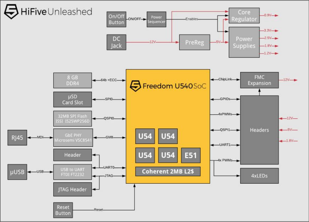
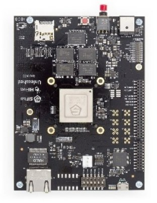
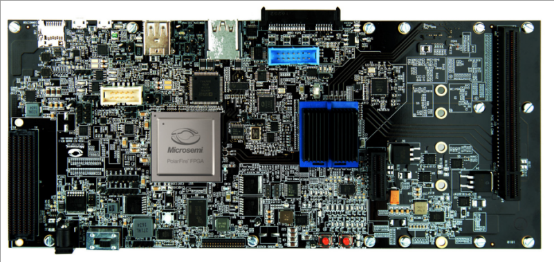
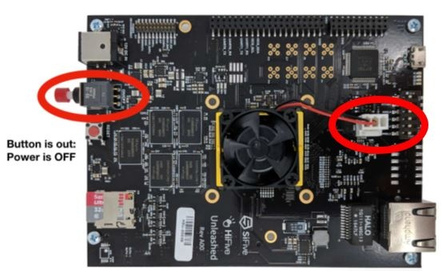
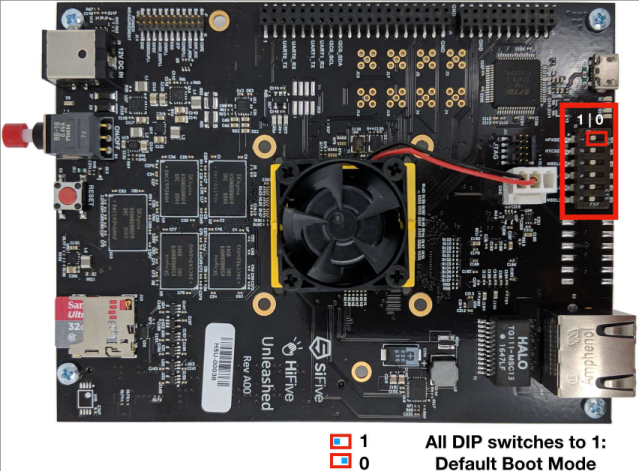
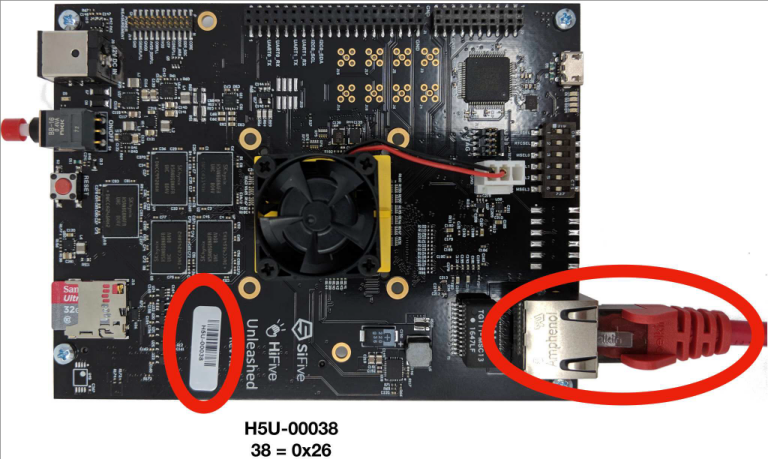
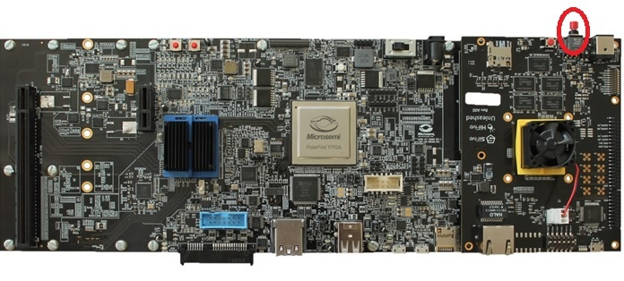
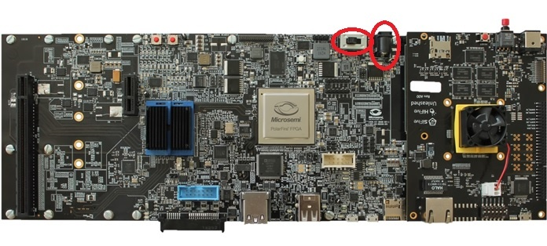
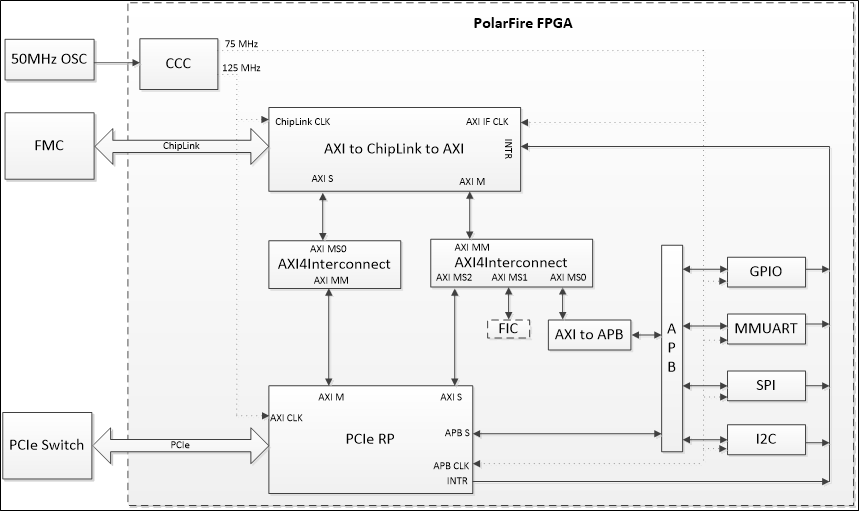

# MPFS-DEV-KIT User Guide

## Overview
The HiFive Unleashed Platform™ is purpose-built to emulate most of the functionality of the upcoming
PolarFire SoC FPGA, which will be the industry’s first RISC-V based FPGA SoC.       
This guide describes the MPFS-DEV-KIT, board setup, and installation steps to get the HiFive Unleashed
platform boot Linux. New IP cores can be ported on the PolarFire FPGA with the Libero SoC PolarFire
Design Suite. For more details on the design suite, see section FPGA Design in Libero.        

### HiFive Unleashed Platform (MPFS-DEV-KIT)   
The HiFive Unleashed Platform consists of the SiFive’s HiFive Unleashed kit and Microsemi’s HiFive
Unleashed Expansion kit with their respective accessories. Microsemi's HiFive Unleashed Expansion
board enables users to create a Linux system running on a RISC-V core complex, with a large FPGA fabric
accessible through the memory map. The expansion board is shipped with a pre-configured bitstream
enabling PCIe root port functionality.          

## HiFive Unleashed Kit
- One SiFive's HiFive Unleashed board
- One power wall adapter 12 V
- One USB-A to micro USB-B cable
- HiFive Unleashed Expansion Kit
- One Microsemi's HiFive Unleashed Expansion Board
- One USB-A to micro USB-B cable
- One 12 V, AC power adapter and cord
- One FlashPro4/FlashPro5 programming dongle
- Two Libero Platinum software licenses of duration one year ($995 value)

SiFive’s HiFive Unleashed development kit is based on the Freedom U540-C000 chip, the first 4+1 multicore RISC-V Linux-capable SoC.

## SiFive Freedom U540 SoC
- 8 GB DDR4 with ECC
- Gigabit Ethernet port
- 32 MB quad SPI flash from ISSI
- MicroSD card for removable storage
- FMC connector for future expansion



The HiFive Unleashed Expansion board contains the following items:
- 300K LE PolarFire FPGA in an FCG1152 package (MPF300TS-1FCG1152EES)
- 24-lane PCIe switch
- eMMC Nand Flash, uSD card slot
- USB to Uart bridges
- 4 Gbit DDR4 x16
- PCI Express x1 card connector
- PCI Express x16 card connector with x4 lane support
- SPI Flash for FPGA remote updates, QSPI Flash connected to GPIO
- FMC connection to HFU540-4A00 kit
- SSD M.2 connector
- SATA connector






## System Setup and Prerequisites
Download and install the following development tools in the PC in order to design, synthesize, simulate,
and debug on the HiFive Unleashed Platform (MPFS-DEV-KIT).

### Programming FlashPro and FlashPro Express
The Microsemi FlashPro programming system is a combination of Microsemi's FlashPro software and a
hardware programmer. Together, they provide in-system programming (ISP) for all FPGA families. The
required programming and debug software is integrated with the Libero SoC PolarFire software. This
software is also available as a standalone programmer for production programming. Visit [Microsemi's
FlashPro page](https://www.microsemi.com/product-directory/programming/4977-flashpro#software) 
to download the standalone programmer (if needed).

| Software | Description | Hardware | Description  |
| --- | --- | --- | --- |
| FP Express | Software for Windows and Linux | FlashPro5 | Hardware programmer for Windows and Linux |
| FlashPro | Software for Windows | FlashPro4 | Hardware programmer for Windows |

### Polarfire SoC Yocto BSP for the HiFive Unleashed Expansion Board
The Polarfire SoC Yocoto BSP builds the requried cross-compile toolchain and software to boot
a Linux system. It includes drivers for Micrsemi PCIe / I2C, SPI, QSPI, CAN and GPIO peripherals.
The build creates wic. gz file which is a compressed sector by sector copy of a bootable microSD card.
The following software applications are copied to the SD card.
 * FSBL (First Stage Boot loader)
 * Opensbi and U-boot
 * DTB (Device Tree Blob)
 * A Linux kernel image


### Firmware Versions
The following table contains links to the schematic, .stp file and .job file for each release.

| Revision | .stp | .job | Schematic |
| --- | --- | --- | --- |
| Initial release | [.stp](http://www.microsemi.com/index.php?option=com_docman&task=doc_download&gid=1244810) | [.job](http://www.microsemi.com/index.php?option=com_docman&task=doc_download&gid=1244809) | [Schematic](http://www.microsemi.com/index.php?option=com_docman&task=doc_download&gid=1244811) |

## Board Setup
Follow the instructions to set up the HiFive Unleashed board.
1. Switch off the power button (red button in the following figure) on the HiFive Unleashed board.
Ensure the fan is plugged in.



2. Set the pins in the DIP-switch block to the as shown in the diagram below. The ON position=0; therefore, this sets MSEL to
mode 1011, which will boot Linux automatically. See the boot modes table in Section 4 of the [HiFive Unleashed Getting Started Guide](https://sifive.cdn.prismic.io/sifive%2Ffa3a584a-a02f-4fda-b758-a2def05f49f9_hifive-unleashed-getting-started-guide-v1p1.pdf) for
more information on MSEL.
```
      USB   LED    Mode Select                  Ethernet
 +===|___|==****==+-+-+-+-+-+-+=================|******|====
 |                | | | | |X| |                 |      |   
 |                | | | | | | |                 |      |   
 |        HFXSEL->|X|X|X|X| |X|                 |______|   
 |                +-+-+-+-+-+-+                            
 |        RTCSEL-----/ 0 1 2 3 <--MSEL                     
 |                                                         
``` 



3. Insert an SD-card programmed with the bootloaders and Linux. 
4. 


4. If available, connect the board to a network switch. The board will run DHCP on boot and start an
ssh server. The MAC address is 70:b3:d5:92:fX:XX, where X:XX is replaced by the board number
converted to hexadecimal. For example, if the board is H5U-00063, then the last digits of the MAC
address are 0:3f.



5. Connect the board through USB to a developer machine. The USB connector has two serial
interfaces: the first contains the Linux console running at 115200 baud and the second provides
JTAG suitable for use with OpenOCD.
6. On the HiFive Unleashed Expansion board, update the PolarFire FPGA with the FPGA bitstream
provided. See section Software Installation and Configuration  for steps to program
the FPGA.
7. The HiFive Unleashed platform is now configured as seen in the FPGA Design in Libero section.
8. Plug-in the HiFive Unleashed board to the HiFive Unleashed Expansion board on the FMC connector.
Push the power button ON on the HiFive Unleashed board.
Note: Do not connect the power supply to the HiFive Unleashed board.



9. Connect the power supply to the HiFive Unleashed Expansion board in order to power the HiFive
Unleashed board.
10. Slide the HiFive Unleashed Expansion board’s power switch (SW3) on. Boot messages should now
appear on the console in the developer's machine.




## Software Installation and Configuration
The following steps explain the procedure to download the FPGA bitstream onto the PolarFire FPGA.
### Programming the FPGA Using FlashPro
#### Windows Environment
To program the PolarFire device with the .stp programming file (using FlashPro in Windows
environment), perform the following steps. The link to the .stp file is given in Firmware Versions.
1. Ensure that the jumper settings on the board are the same as those listed in Jumper Settings.
Note: The power supply switch must be switched off while making the jumper connections.
2. Connect the power supply cable to the J3 connector on the board.
3. Connect the FlashPro4 to a PC USB port and to the connector J24 (FP4 header) of the HiFive Unleashed Expansion board.
4. Power on the board using the SW3 slide switch.
5. On the host PC, launch the FlashPro software.
6. Click `New Project` to create a new project. In the `New Project` window, enter a project name.
7. Click `Browse` and navigate to the location where you want to save the project.
8. Select `Single Device` as the programming mode and click `OK` to save the project.
9. Click `Configure Device`.
10. Click `Browse`, and navigate to the location where the `HFU540_EXP_Bitstream_r20101.stp` file is
located and select the file.
11. Click `Open`. The required programming file is selected and ready to be programmed in the device.
12 .Click `PROGRAM` to program the device. When the device is programmed successfully, a Run PASSED
status is displayed.
See the [FlashPro User Guide](https://www.microsemi.com/document-portal/doc_download/137626-flashpro-user-guide-for-polarfire) for more information.

#### Linux Environment
To program the PolarFire device with the .job programming file (using FlashPro5 programmer in Linux
environment), perform the following steps. The link to the .job file can be found in Firmware Versions.
1. Ensure that the jumper settings on the board are the same as those listed in Jumper Settings.
Note: The power supply switch must be switched off while making the jumper connections.
2. Connect the power supply cable to the J3 connector on the board.
3. Connect the FlashPro5 to a PC USB port and to the connector J24 (FP4 header) of the HiFive Unleashed Expansion board.
4. Power on the board using the SW3 slide switch.
5. On the host PC, launch the FlashPro Express (FP Express) software.
6. From the Project menu, choose Create Job Project from Programming Job.
7. Click Browse to load the Programming Job File HFU540_EXP_Bitstream_r20102.job, and specify your FlashPro Express job project location. Click OK to continue.
8.  Save the FlashPro Express job project.
9.  Set the Programming Action in the dropdown menu to PROGRAM.
10. Click RUN. Detailed individual programmer and device status information appears in the `Programmer List`. Your programmer status (PASSED or FAILED) appears in the `Programmer Status` Bar.
See the [FlashPro Express User Guide](https://www.microsemi.com/document-portal/doc_download/137627-flashpro-express-user-guide-for-polarfire) for more information.

| Switch | Ref | Section | Description | Definition | Default |
| --- | --- | --- | --- | --- | --- |
|1| SW3 |Power switch| Sliding switch for 12 V input |Open: DC adaptor 12 V is not connected to the board power  | Open
|||||Closed: DC adaptor 12 V is connected to board power supplies ||
| 2 | SW5 | PCIe switch (Switchtec) | Selection of Normal/Boot Recovery mode for PCIe switch | 0: Boot recovery mode | 1–2: Normal mode |
||||| 1: Normal mode |
| 3| J25 | SATA controller|Between SPI flash output to input of PCIe to SATA controller |Open: SPI flash o/p is not connected to PCIe to SATA controller | Close |
|||||Close: SPI flash o/p is connected to PCIe to SATA controller ||
|4|J31| USB instance 1 | VBUS source selection (onboard 5 V/USB connector)|Open: VBUS sourced by USB connector (Device mode) | Close
|||||Close: On-board 5 V to USB CONN (Host mode) ||
|6| J27 | USB instance 2 | Configuring USB PHY (U60) as host/device|Open: USB3340 acts as device|Close|
|||||Close: USB3340 acts as host||
|7| J30 USB instance 2 | VBUS source selection (onboard 5 V/USB connector)|Open: VBUS sourced by USB connector (Device mode)|Close|
|||||Close: On-board 5 V to USB CONN (Host mode)||
|8| J21 |SC-SPI |SC-SPI I/O configuration interface|Open: SC SPI acts as master|Close|
|||||Close: SC SPI acts as slave||
|9| J22 |JTAG |Weak pull down to JTAG TRSTB|Open: 1K pull down connected to TRSTB| Open|
|||||Close: 1K||100K pull down connected to TRSTB||

## Building and Loading the Linux Image
For instructions on how to build and load a Linux image, see the Linux build instructions in [top level readme](../README.md).

## FPGA Design in Libero
Libero SoC Design suite provides a comprehensive design flow including traditional FPGA design flow,
embedded design flow, and graphical configurators. The suite provides a comprehensive development
environment to build embedded solutions using hard core and soft core processors.            
The FPGA design has provision to interface the PolarFire FPGA (in the HiFive Unleashed Expansion
board) with the HiFive Unleashed board using the ChipLink interface. The FPGA fabric is instantiated
with the ChipLink to AXI bridge, while peripherals (GPIO, MMUART, SPI, and I2C) are connected to it 
using the CoreAXIInterconnect, AXI to AHB, AHBLite, and CoreAPB IPs. The PolarFire PCIe AXI Slave is
connected to the AXI2CL2AXI bridge through CoreAXIInterconnect. One AXI port is exposed and marked
as unused and can connect to user logic.            
The ChipLink interface uses 125 MHz clock and AXI interface uses 75 MHz clock.           
The high-level block diagram for the Libero project implemented on the PolarFire FPGA is as seen in the
following figure.         



More IPs are being ported on the HiFive Unleashed Platform and will be made available on request.
### Memory Map
The IPs ported on the PolarFire FPGA are accessible from the RISC-V U540 memory map as listed in the
following table. The interrupt number 42 is used for all the peripherals.

| Peripherals | Mem Requirement | Start Address | End Address | Mem Allocation| Comments
| --- | --- | --- | --- | --- | --- |
| PCIe | --- | --- | --- | --- | --- |
| PCIe Config Space | 256 MB | 0x2030000000 | 0x203fffffff | 256 MB | --- |
| PCIe Mem Space 32 | 512 MB | 0x0040000000 | 0x005fffffff | 512 MB | --- |
| PCIe Mem Space 64 | 2 GB   | 0x2080000000 | 0x20ffffffff | 2048 MB| --- |
| PCIe APB Space    | 1 MB   | 0x2000000000 | 0x20000fffff | 1 MB   | --- |
| Peripherals | --- | --- | --- | --- | --- |
| I2C_0 | 4 KB | 0x2000100000 | 0x2000100fff | 4095 KB | I2C0 header |
| Reserved | 4 KB | 0x2000101000 | 0x2000101fff | 4095 KB | Reserved |
| GPIO 4 KB | 0x2000103000 | 0x2000103fff | 4095 KB | GPIO Implementation |
| MMUART_0 | 4 KB | 0x2000104000 | 0x2000104fff | 4095 KB | J36 |
| Reserved | 4 KB | 0x2000105000 | 0x2000105fff | 4095 KB | Reserved |
| Reserved | 4 KB | 0x2000106000 | 0x2000106fff | 4095 KB | Reserved |
| SPI_0 | 4 KB | 0x2000107000 | 0x2000107fff | 4095 KB | SPI0 header |
| Reserved | 4 KB | 0x2000108000 | 0x2000108fff | 4095 KB | Reserved | 
| FIC (AXI) | 256 MB | 0x2010000000 | 0x201fffffff | 256 MB | To connect with user logic |
| free space | --- | 0x2020000000 | 0x202fffffff | 256 MB |

### GPIO Implementation
The GPIO implemented in the design is pinned out as a starting point for your custom design
implementation. The details of the GPIO pinout is listed in the following table:

| GPIO | Function |
| --- | --- |
| 0 | led4 |
| 1 | led5 |
| 2 | J2-pin13 |
| 3 | J2-pin14 |
| 4 | sw9 |
| 5 | sw10 |
| 6 | J2-pin9 |
| 7 | USB1 reset |

## Reference
Visit the following links for further reference reading materials.
### Recommended Reading
[RISC-V User-level ISA Specification](https://riscv.org/specifications/)     
[RISC-V Draft Privileged ISA Specification](https://riscv.org/specifications/privileged-isa/)     
[SiFive FU540-C000 User Manual](https://www.sifive.com/documentation/chips/freedom-u540-c000-manual/)     
[TU0844 Libero SoC PolarFire v2.2 Design Flow Tutorial](https://www.microsemi.com/document-portal/doc_download/1243632-tu0844-libero-soc-polarfire-v2-2-design-flow-tutorial)     
[HiFive Unleashed Getting Started Guide](https://www.microsemi.com/document-portal/doc_download/1243284-hifive-unleashed-getting-started-guide)     
### Reference
[PolarFire FPGA Documentation](https://www.microsemi.com/product-directory/fpgas/3854-polarfire-fpgas#documentation)     
[Libero SoC PolarFire Documentation](https://www.microsemi.com/product-directory/design-resources/3863-libero-soc-polarfire#documents)     
[FlashPro User Guide for PolarFire](https://www.microsemi.com/document-portal/doc_download/137626-flashpro-user-guide-for-polarfire)     
[FlashPro Express User Guide for PolarFire](https://www.microsemi.com/document-portal/doc_download/137627-flashpro-express-user-guide-for-polarfire)     

## Technical Support
For technical queries, visit the [Microsemi SoC Customer Portal](https://soc.microsemi.com/Portal/Default.aspx), select “PolarFire SoC” under Product Family, “MPFSXXXX” under Device Family and type in the query. Microchip’s technical support team will create a ticket, address the query and track it to completion
